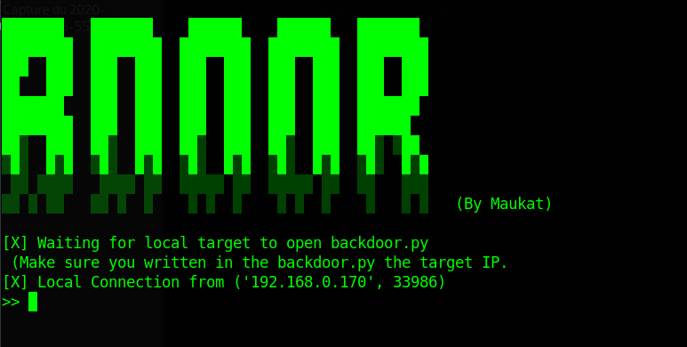

# BDoor 1.0

 

BDoor is a script in python 3, with BDoor, you can download files or execute commands from your computer to someone in the same network as you.
You will need to put the target IP in the backdoor.py
And your IP in the listenening.py
Once you finished, you can start getting control by choosing option 2
When the target will open the backdoored file.
You will start getting access

Example of possibles things :
```
cd tests
download downloadtest.png / upload image.png
```

Please note that this script is still in developement

- compatible with Debian.
- *Maybe* compatible with Windows.

## Next updates

* Suggest updates on my discord

### Installation

```
git clone https://github.com/Loubaris/BDoor-Backdoor-Python
cd BDoor
python3 main.py

------ Target -------
Only need to open backdoored file

```


## Contact

You can contact me on discord https://discord.gg/yKQ3MYh
